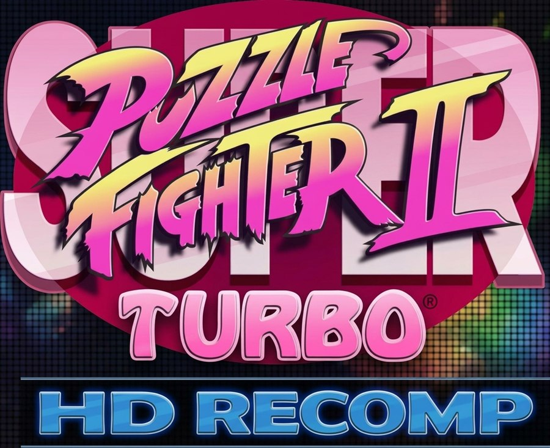

<p align="center">
  
</p>

# Puzzle Fighter Turbo HD - ReXGlue Recomp

Native static recompilation of the Xbox 360 XBLA release of *Puzzle Fighter
Turbo HD* (the HD Remix of *Puzzle Fighter II*), built against the bundled
ReXGlue SDK in `..\rexglue\win-amd64`.

> **On the name:** the official XBLA listing for title ID `5841086E` is titled
> simply *"Puzzle Fighter HD"* - see `ArcadeInfo.xml` in the extracted game
> data, where every locale `TitleInfo` entry uses that name. The logo art and the
> Japanese release call it *Puzzle Fighter Turbo HD*. Both refer to this same
> recomp.

## Status

Working. The guest boots, initializes memory and input, and produces real
Xenos video output through the emulated GPU. See `out\shot.png` for a capture
of the running game (character select / attract intro).

Verified working end to end:

- 123 objects compiled and linked into `puzzlefighter.exe`
- 8,649 guest functions registered
- Clean run: no fatal errors, no stderr output
- DualSense gamepad input and menu navigation confirmed on hardware
- In-game screen size switching works
- Matches playable to completion

Note: on a hi-DPI desktop the window is sized in logical pixels (e.g. 1707x960
at 3840x2160 / 225% scaling). Non-16:9 window modes letterbox, which is
expected; the in-game screen scaling setting can be used if the bars bother you.

## Build

```
cmake --build out\build\win-amd64-release
```

## Run

```
.\tools\run.ps1                 # interactive, 1280x720
.\tools\run.ps1 -Resolution 720p
.\tools\run.ps1 -Fullscreen
.\tools\run.ps1 -Seconds 40 -Shot    # timed run, writes out\shot.png
```

`tools\run_detached.cmd [seconds]` runs the same thing in a detached process,
useful when the capture timer would otherwise outlive an interactive shell.

The two launch settings that matter are both baked into `run.ps1`:

- `--gpu_plugin xenos` - selects the Xenos emulation plugin. The plugin is
  loaded at runtime, never linked, so CMake's `TARGET_RUNTIME_DLLS` does not
  pick it up; `rexglue_setup_target(... GPU_PLUGINS xenos)` only stages the DLL
  next to the executable.
- `--game_data_root "<path>"` - the path contains spaces and **must** stay
  quoted, otherwise the guest parses it as several arguments and comes up
  against a wrong (and non-existent) data root.

## Notes

`puzzlefighter_overrides.toml` holds guest entry points that the static scanner
misses. Each is reachable only via a computed branch, so codegen classifies it
as a tail-call chunk of the preceding function and merges it away; the guest then
traps at dispatch. Declaring the address as its own function (`parent = 0`)
forces a real entry.
